# Application Logic Flow

This diagram illustrates the step-by-step logical decisions made by the application. It follows the journey of a single video from discovery to completion, focusing on the `if/else` checks that determine its path.

```mermaid
graph TD
    A[Start] --> B{Load Config};
    B --> C[Discover Videos];

    subgraph Video Discovery
        C --> D{For each video from channel};
        D --> E{Summary already exists?};
        E -- Yes --> D;
        E -- No --> F[Fetch full video metadata];
        F --> G{Is video duration > MAX_VIDEO_LENGTH?};
        G -- No --> J[Video is valid];
        G -- Yes --> H{APPLY_MAX_LENGTH_FOR_CAPTIONLESS_ONLY is True?};
        H -- No --> I[Video is invalid, skip];
        H -- Yes --> H2{Video has captions?};
        H2 -- Yes --> J;
        H2 -- No --> I;
        I --> D;
        J --> K{Add to processing queue};
        K --> L{Queue full based on NUM_VIDEOS_TO_PROCESS?};
        L -- No --> D;
        L -- Yes --> M[Stop discovery];
    end

    M --> N[Process Videos];

    subgraph Video Processing
        N --> O{For each valid video};
        O --> P{Local transcription file exists?};
        P -- Yes --> Z[Use existing transcription];
        P -- No --> Q{Video has captions?};
        Q -- Yes --> R[Attempt to download captions];
        R --> S{Caption download successful?};
        S -- Yes --> Z;
        S -- No --> T[Fallback: Transcribe from audio];
        Q -- No --> T;
        T --> T2[Download Video -> Extract Audio -> Transcribe Audio];
        T2 --> Z;
    end

    subgraph Summarization
        Z --> AA{IS_OPENAI_RUNTIME is True?};
        AA -- No --> AB[Use raw transcription as summary];
        AA -- Yes --> AC[Check transcription token count];
        AC --> AD{Is token count > CHUNK_TARGET_SIZE?};
        AD -- Yes --> AE[Summarize in chunks recursively];
        AD -- No --> AF[Summarize directly];
        AE --> AG[Final Summary];
        AF --> AG;
        AB --> AG;
    end

    subgraph Cleanup
        AG --> AH[Save final summary];
        AH --> AI{IS_SAVE_ONLY_SUMMARIES is True?};
        AI -- Yes --> AJ[Delete intermediate files: video, audio, transcription];
        AI -- No --> AK[End];
        AJ --> AK;
    end
```

